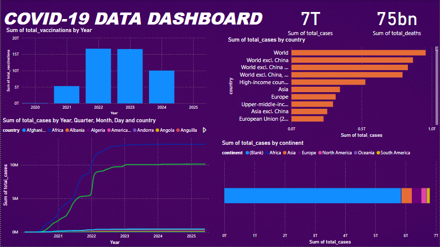

# COVID-19 Data Dashboard using PySpark and Power BI

## 🔧 Built With:


## 🛢️ Database Used:


## ☁️ Data Source:
[Our World in Data - COVID-19](https://ourworldindata.org/covid-data)


## 🌐 Domain:


---

## 📦 Compressed Data

The dataset used for this ETL pipeline and Power BI dashboard is stored in a compressed format to reduce size and improve portability.

- **File Name:** `compact_covid_data.csv.gz`
- **Format:** GZIP-compressed CSV
- **Original Size:** ~137 MB
- **Compressed Size:** ~[Insert actual compressed size]

⚠️ If you download this file manually, please extract it before loading into any tools that do not support `.gz` files directly.

## 🛠️ How the ETL Works:

This project performs a basic **ETL (Extract-Transform-Load)** process on worldwide COVID-19 data using PySpark.

### 🔹 Extract
- Downloads CSV from OWID.
- Saves into a local `/data/` directory.
- Uses PySpark to read the file as a DataFrame.

### 🔹 Transform
- Filters nulls and invalid rows.
- Selects relevant columns like `location`, `date`, `total_cases`, `total_deaths`, `total_vaccinations`.
- Converts date columns to proper format and casts numeric fields.

### 🔹 Load
- Data is saved in two formats:
  - Locally as a CSV file (`compact_covid_data.csv`)
  - To **PostgreSQL** database hosted on **Supabase (Vercel Cloud)** via **JDBC**.
- The `.jar` file for PostgreSQL connector is referenced while running the script in Google Colab.

⚠️ **Note:** This pipeline is **NOT automated** due to the live nature of the data and inconsistent updates from the OWID dataset.

## 📊 Power BI Integration:

### 🔐 Connection:
- Connected to **PostgreSQL** via **ODBC driver**.
- ODBC setup includes:
  - DSN configuration
  - PostgreSQL username/password
  - `SSL Mode: require` to handle remote certificate

### 🧪 Troubleshooting Faced:
- Fixed timeout issues by optimizing queries.
- Ensured data type recognition in Power BI's Power Query Editor.
- Casted blank strings to NULL for proper aggregation.

## 📸 Dashboard Preview



This dashboard shows:
- 🌍 Total vaccinations and cases by country
- 📈 Time series of cases vs vaccinations
- 🔍 Filters for continent, location, date
- ✅ Interactive visuals powered via Power BI slicers

## 📥 Requirements (`requirements.txt`):

```
pyspark==3.4.1
requests
psycopg2-binary
```

---
## 📁 Folder Structure

```
covid_etl_project/
│
├── covid_etl_package/
│   ├── __init__.py
│   ├── extract.py
│   ├── transform.py
│   ├── load.py
│
├── data/
│   └── compact_covid_data.csv.gz
│
├── dashboard.pbix
├── requirements.txt
├── README.md
```

---

## 📝 Summary:

This project demonstrates a complete **end-to-end data engineering and visualization solution**:
- ✅ Built in **Colab** (Python & PySpark)
- ✅ Stored on **Supabase PostgreSQL**
- ✅ Visualized using **Power BI Desktop**
- ❌ Not automated (due to OWID data reliability)
---


## 🚫 Note

- Data source may not update regularly.
- This is a one-time ETL and dashboard pipeline.
- Scheduling is **not implemented** due to static data.

